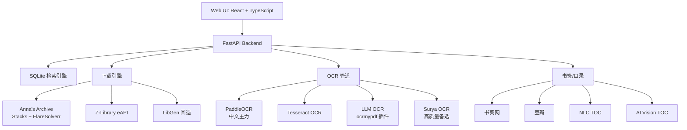

# 📚 Ebook PDF Downloader

[](https://python.org)
[](https://react.dev)
[](https://fastapi.tiangolo.com)
[](LICENSE)
[](https://github.com/PaddlePaddle/PaddleOCR)

> **全自动电子书下载与处理管道。从本地数据库和在线书源检索、下载、OCR 识别、目录生成到最终输出，一站式完成。**

Ebook PDF Downloader 是一款全栈电子书下载工具，内置 React 前端和 FastAPI 后端。支持本地 SQLite 数据库检索（DX_2.0-5.0 / DX_6.0），多源在线下载（Anna's Archive + Z-Library + LibGen），四引擎 OCR（Tesseract / PaddleOCR / LLM OCR / Surya OCR），智能书签/目录生成。

---

## ✨ Features

-   **🔍 多源检索**: 本地 SQLite 数据库 + Anna's Archive + Z-Library 外部回退，多字段组合搜索
-   **📥 智能下载**: FlareSolverr 绕过 Cloudflare，Stacks 队列管理，Z-Library eAPI，IPFS/BT 回退
-   **⚙️ OCR 管道**: PaddleOCR（中文主力）+ Tesseract + LLM OCR + Surya OCR 四引擎
-   **📑 目录生成**: 书葵网 + 豆瓣 + NLC 三源合并，AI Vision 智能 TOC 提取
-   **🎨 Web UI**: React + TypeScript + Tailwind CSS，WebSocket 实时进度，深色模式
-   **🔒 100% 本地**: 无需云 API，数据完全私有。LLM OCR 可选配置本地/远程端点

---

## 🏗️ Architecture



### 处理管道

```
检索信息 → 获取 ISBN → 下载 PDF → 转换 → OCR 识别 → 目录处理 → 完成
```

---

## 🚀 Getting Started

### 便携版（推荐）

从 [Releases](https://github.com/Callioper/ebook-pdf-downloader/releases) 下载 `ebook-pdf-downloader.exe`，双击运行。

```
ebook-pdf-downloader.exe → 自动打开浏览器 → http://localhost:8000
```

### 安装版

下载 `ebook-pdf-downloader-setup.exe`，安装到 `Program Files`，自动创建桌面快捷方式。

### 源码运行

```bash
git clone https://github.com/Callioper/ebook-pdf-downloader.git
cd ebook-pdf-downloader/backend
pip install -r requirements.txt
python main.py
```

---

## ⚙️ Configuration

在设置页（右上角 ⚙️）中配置：

| 配置项 | 说明 | 默认值 |
|--------|------|--------|
| SQLite 数据库目录 | 存放 `DX_2.0-5.0.db` / `DX_6.0.db` | 自动检测 |
| 下载目录 | 临时存放 | `~/Downloads` |
| 保存目录 | 最终输出 | `~/Downloads/finished` |
| HTTP 代理 | 访问外网 | （可选） |
| OCR 引擎 | `tesseract` / `paddleocr` / `llm_ocr` | `tesseract` |
| OCR 语言 | 识别语言 | `chi_sim+eng` |
| Stacks URL | AA 下载服务器 | `http://localhost:7788` |
| Z-Library 邮箱/密码 | 自动搜索下载 | （可选） |
| AA 会员 Key | 高速下载 | （可选） |
| LLM OCR 端点 | 本地/远程 LLM 服务 | （可选） |

---

## 📦 Dependencies

### 必需（手动安装）

| 组件 | 用途 | 安装 |
|------|------|------|
| **Python 3.10+** | 运行环境 | [python.org](https://www.python.org/downloads/) |
| **数据库文件** | 本地检索 | [EbookDatabase 下载文档](https://github.com/Hellohistory/EbookDatabase/blob/main/Markdown/%E6%95%B0%E6%8D%AE%E5%BA%93%E4%B8%8B%E8%BD%BD%E6%96%87%E6%A1%A3.md) |
| **Tesseract OCR** | OCR 默认引擎二进制 | `winget install UB-Mannheim.TesseractOCR` |

> 下载数据库文件（`DX_2.0-5.0.db` / `DX_6.0.db`）后，放入 `backend/data/` 目录或任意目录，在设置页配置路径即可。

### 可选安装

| 组件 | 用途 | 安装方式 |
|------|------|----------|
| **FlareSolverr** | Cloudflare 绕过 | 设置页 → 一键安装 |
| **PaddleOCR** | 中文 OCR（推荐） | 设置页 → OCR 面板 |
| **Surya OCR** | 高质量 OCR 备选 | `pip install surya-ocr` |
| **aria2c** | BT 下载引擎 | 已内置 |

### 前端开发

```bash
cd frontend
npm install
npm run build
```

---

## 🔧 Usage

### Web 界面

1. 启动 `ebook-pdf-downloader.exe`，浏览器自动打开
2. 搜索 → 选择书籍 → **开始任务**
3. 实时查看管道进度（WebSocket 更新）
4. 任务完成 → 打开 PDF 或文件夹

### API 端点

| 方法 | 路径 | 说明 |
|------|------|------|
| GET | `/api/v1/search` | 搜索电子书 |
| POST | `/api/v1/tasks` | 创建下载任务 |
| POST | `/api/v1/tasks/{id}/start` | 启动处理管道 |
| POST | `/api/v1/tasks/{id}/retry` | 重试失败任务 |
| POST | `/api/v1/tasks/{id}/cancel` | 取消任务 |
| POST | `/api/v1/tasks/{id}/pause` | 暂停任务 |
| POST | `/api/v1/tasks/{id}/resume` | 恢复任务 |
| DELETE | `/api/v1/tasks/completed` | 清除已完成 |
| GET | `/api/v1/tasks/{id}/open` | 打开 PDF |
| GET | `/api/v1/tasks/{id}/open-folder` | 打开文件夹 |
| GET/POST | `/api/v1/config` | 配置管理 |
| GET | `/api/v1/check-update` | 版本更新检查 |
| POST | `/api/v1/check-proxy` | 代理检测 |
| GET | `/api/v1/detect-paths` | 智能查找数据库 |
| WS | `/api/v1/ws` | WebSocket 实时通信 |

---

## 📁 Project Structure

```
├── backend/
│   ├── main.py              # FastAPI 入口
│   ├── config.py            # 配置管理
│   ├── version.py           # 版本号
│   ├── search_engine.py     # SQLite 检索引擎
│   ├── task_store.py        # 任务持久化
│   ├── ws_manager.py        # WebSocket 管理
│   ├── api/                 # REST API（search/tasks/ws）
│   ├── engine/              # 核心引擎
│   │   ├── pipeline.py      # 7 步处理管道
│   │   ├── aa_downloader.py # Anna's Archive 下载
│   │   ├── stacks_client.py # Stacks 队列客户端
│   │   ├── flaresolverr.py  # FlareSolverr 集成
│   │   ├── zlib_downloader.py # Z-Library curl_cffi
│   │   ├── surya_embed.py   # Surya OCR 集成
│   │   └── llmocr/          # LLM OCR 插件
│   ├── nlc/                 # NLC 元数据爬虫
│   ├── book_sources/        # 豆瓣等书源
│   ├── addbookmark/         # 书签/目录模块
│   └── data/                # 数据库文件（自动检测）
├── frontend/                # React + TypeScript + Tailwind
├── setup.iss                # Inno Setup 安装脚本
├── release.py               # 构建 & 发布脚本
└── 启动.cmd                  # Windows 启动器
```

---

## 📊 OCR 引擎对比

| 引擎 | 速度 | 中文准确度 | 资源占用 | 推荐场景 |
|------|------|-----------|---------|---------|
| **PaddleOCR** | ~24min/217p | ★★★★★ | 中等，CPU | 中文文档主力 |
| **Tesseract** | ~15min/217p | ★★★☆☆ | 低，CPU | 英文/轻量使用 |
| **LLM OCR** | 取决于 API | ★★★★☆ | 远端 | 高质量需求 |
| **Surya OCR** | ~155s/5p | ★★★★☆ | 高，GPU | 高精度备选 |

---

## 🙏 Acknowledgements

| 项目 | 用途 |
|------|------|
| [stacks](https://github.com/zelestcarlyone/stacks) | AA 下载架构、fast_download API |
| [FlareSolverr](https://github.com/FlareSolverr/FlareSolverr) | Cloudflare/DDoS-Guard 绕过 |
| [OCRmyPDF](https://github.com/ocrmypdf/OCRmyPDF) | PDF OCR 引擎 |
| [PaddleOCR](https://github.com/PaddlePaddle/PaddleOCR) | 中文 OCR 核心引擎 |
| [Surya OCR](https://github.com/VikParuchuri/surya) | 高精度 OCR 检测 |
| [aria2](https://github.com/aria2/aria2) | BitTorrent/HTTP 下载 |
| [NLCISBNPlugin](https://github.com/DoiiarX/NLCISBNPlugin) | NLC ISBN 查询 |
| [书葵网](https://www.shukui.net/) | 图书目录/书签数据 |
| [Anna's Archive](https://annas-archive.org/) | 开放图书数据源 |
| [Z-Library](https://z-lib.sk/) | 图书下载源 |

---

## 📄 License

MIT © Ebook PDF Downloader
