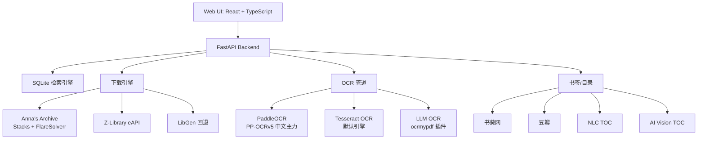

# 📚 Ebook PDF Downloader

[](https://python.org)
[](https://react.dev)
[](https://fastapi.tiangolo.com)
[](LICENSE)
[](https://github.com/PaddlePaddle/PaddleOCR)

> **全自动电子书下载与处理管道。从本地数据库和在线书源检索、下载、OCR 识别、目录生成到最终输出，一站式完成。**

Ebook PDF Downloader 是一款全栈电子书下载工具，内置 React 前端和 FastAPI 后端。支持本地 SQLite 数据库检索（DX_2.0-5.0 / DX_6.0），多源在线下载（Anna's Archive + Z-Library + LibGen），三引擎 OCR（Tesseract / PaddleOCR / LLM OCR），智能书签/目录生成。

---

## ✨ 功能特性

-   **🔍 多源检索**: 本地 SQLite 双库并行搜索，Anna's Archive title/ISBN 匹配，Z-Library eAPI 三层检索（ISBN 精确 → 书名+作者 → 书名），自动 ISBN + SS 码去重
-   **📥 智能下载**: Stacks 队列管理 Anna's Archive 下载，FlareSolverr 自动绕过 Cloudflare/DDoS-Guard，Z-Library 邮箱登录直达下载链接，LibGen torrent hash 回退
-   **⚙️ OCR 三引擎**: PaddleOCR（PP-OCRv5, 中文主力 ~24min/217 页）、Tesseract 默认引擎、LLM OCR（ocrmypdf 插件，支持任意 OpenAI 兼容端点）
-   **🎯 OCR 可选确认**: 管道执行到 OCR/目录步骤时弹出确认对话框，显示当前引擎和配置，用户可选择跳过
-   **📑 智能目录**: 书葵网 + 豆瓣 + NLC 三源书签合并，AI Vision 智能 TOC 提取（支持 OpenAI/Anthropic 本地 LLM），自动注入 PDF 书签
-   **🎨 现代化 Web UI**: React 18 + TypeScript + Tailwind CSS，WebSocket 实时进度更新，步骤进度条，日志流查看，深色模式
-   **⏯️ 任务控制**: 暂停/恢复/重试/取消，子进程挂起恢复，已完成任务自动清理
-   **🔒 100% 本地优先**: 所有核心功能无需云 API，LLM OCR 可选配置本地/远程端点，数据完全私有

---

## 🏗️ 架构



### 工作原理

1. **检索**: 输入书名/作者/ISBN → 本地 SQLite 双库并行搜索 → 无结果则自动回退 Anna's Archive + Z-Library
2. **获取 ISBN**: NLC 元数据爬虫 + 豆瓣 search by title → 补全 ISBN/作者/出版社/年份
3. **下载 PDF**: Stacks 队列下载（优先） → Z-Library eAPI → LibGen 兜底，FlareSolverr 自动绕过 Cloudflare
4. **转换**: 下载的页面/压缩包自动封装为 PDF
5. **OCR 识别** (可选): 弹出确认对话框 → 选引擎（PaddleOCR / Tesseract / LLM OCR）→ ocrmypdf 执行 → 自动检测扫描页 → CJK 可读性校验
6. **目录处理** (可选): 书葵网 + 豆瓣 + NLC 三源书签合并 → AI Vision 智能 TOC 提取 → 自动注入 PDF
7. **完成**: 保存到 finished_dir → 生成任务报告 → 打开 PDF

---

## 🚀 快速开始

### 前置条件

| 组件 | 用途 | 安装方式 |
|------|------|----------|
| **Python 3.10+** | 运行环境 | [python.org](https://www.python.org/downloads/) |
| **数据库文件** | 本地检索 | [EbookDatabase 下载文档](https://github.com/Hellohistory/EbookDatabase/blob/main/Markdown/%E6%95%B0%E6%8D%AE%E5%BA%93%E4%B8%8B%E8%BD%BD%E6%96%87%E6%A1%A3.md) |
| **Tesseract OCR** | OCR 默认引擎 | `winget install UB-Mannheim.TesseractOCR`（勾选中英文语言包） |

> 下载 `DX_2.0-5.0.db` / `DX_6.0.db` 后放入 `backend/data/` 目录，启动后在设置页 - 数据库路径中点击"智能查找"自动扫描常见位置。

### 🤖 AI Agent 一键安装

将以下提示词发送给 [opencode](https://github.com/anomalyco/opencode) 或任意 AI 编程助手，即可自动完成环境搭建：

````
请帮我安装并配置 Ebook PDF Downloader（https://github.com/Callioper/ebook-pdf-downloader）：

首先询问我选择哪种安装方式：
A）便携版：下载 exe 直接运行（推荐，无需安装依赖）
B）源码版：克隆仓库，手动搭建所有依赖

---

如果选择 A（便携版）：
1. 从 Releases（https://github.com/Callioper/ebook-pdf-downloader/releases/latest）下载 `ebook-pdf-downloader.exe`
2. 双击运行，确认浏览器自动打开 http://localhost:8000
3. 帮我检查是否需要以下外部工具，缺失则指引下载：
   - Tesseract OCR：`winget install UB-Mannheim.TesseractOCR`（OCR 默认引擎，安装时勾选中英文语言包）
   - 数据库文件：从 EbookDatabase 项目下载 `DX_2.0-5.0.db` 和 `DX_6.0.db`，在设置页配置路径

---

如果选择 B（源码版）：
1. 克隆仓库：`git clone https://github.com/Callioper/ebook-pdf-downloader.git`
2. 检查并安装前置条件：
   - Python 3.10+：`python --version`
   - Node.js 18+：`node --version`（编译前端需要）
   - Tesseract OCR：`winget install UB-Mannheim.TesseractOCR`（勾选中英文语言包）
   - 数据库文件：放入 `backend/data/` 目录，缺失则从 EbookDatabase 项目下载

3. 安装后端依赖：
   ```
   cd ebook-pdf-downloader/backend
   pip install -r requirements.txt
   ```

4. 编译前端：
   ```
   cd ../frontend
   npm install
   npm run build
   ```

5. 启动：`cd ../backend && python main.py`

---

无论哪种方式，选配安装以下功能（逐一询问我是否需要）：

- **PaddleOCR 中文引擎**：创建独立 Python 3.11 venv（路径如 `venv-paddle311`），在其中安装 PaddlePaddle + PaddleOCR。设置页 OCR 面板提供一键安装脚本
- **stacks（Anna's Archive 下载服务器）**：克隆 https://github.com/zelestcarlyone/stacks ，执行 Docker Compose 构建并启动容器（默认端口 7788）。stacks 内已集成 FlareSolverr，无需单独安装
- **LLM OCR**：配置 OpenAI 兼容端点（LM Studio / Ollama / vLLM），在设置页填入 API 地址和模型名（推荐 `allenai/olmocr-2-7b` 或 `qwen/qwen3-vl-8b`）
- **AI Vision TOC**：配置 OpenAI/Anthropic 兼容端点，用于智能 PDF 目录提取。设置页中填入端点和模型名，建议先用本地模型测试（如 Ollama glm-ocr）
- **aria2c**：（exe 已内置，源码版需单独下载）BT/IPFS 下载引擎，用于 LibGen 回退下载

最后：打开设置页（右上角 ⚙️），检查并补全以下关键配置：
- 数据库路径（如有）
- HTTP 代理（如需要）
- stacks 地址和密钥（如已安装）
- Z-Library 邮箱/密码（如需要）
- OCR 引擎偏好
````

将上述提示词复制发送给 AI 助手，它会逐步引导完成安装和配置。

### 便携版（推荐）

从 [Releases](https://github.com/Callioper/ebook-pdf-downloader/releases) 下载 `ebook-pdf-downloader.exe`，双击运行：

```
ebook-pdf-downloader.exe → 自动打开浏览器 → http://localhost:8000
```

打包内置了前端、Python 运行时和所有依赖，无需额外安装。

### 安装版

下载 `ebook-pdf-downloader-setup.exe`，安装到 `Program Files`，自动创建桌面快捷方式和开始菜单项，支持自定义安装目录和完整卸载。

### 源码安装

```bash
# 克隆仓库
git clone https://github.com/Callioper/ebook-pdf-downloader.git
cd ebook-pdf-downloader

# 安装后端依赖
cd backend
pip install -r requirements.txt

# 编译前端（可选，后端已包含预编译静态文件）
cd ../frontend
npm install
npm run build

# 启动
cd ../backend
python main.py
```

> PaddleOCR 需要独立 Python 3.11 venv（PaddlePaddle MKL 冲突）。进入设置页 → OCR 面板 → 一键安装 PaddleOCR。

---

## ⚙️ 配置

启动后在 Web UI 右上角 **⚙️ 设置** 中配置，所有更改即时生效：

| 配置项 | 说明 | 默认值 |
|--------|------|--------|
| **数据库** | | |
| SQLite 数据库目录 | `DX_2.0-5.0.db` / `DX_6.0.db` 所在路径 | 自动检测 |
| **下载** | | |
| 下载目录 | 临时存放 | `Downloads` |
| 保存目录 | 最终输出 | `Downloads/finished` |
| HTTP 代理 | 访问外网 | （可选） |
| Stacks 地址 | AA 下载服务器 | `http://localhost:7788` |
| Stacks 用户名/密码 | Docker 容器凭证 | （可选） |
| Z-Library 邮箱/密码 | 自动搜索下载 | （可选） |
| AA 会员 Key | 高速下载 | （可选） |
| ZFile 地址/密钥 | ZFile 网盘下载 | （可选） |
| **OCR** | | |
| OCR 引擎 | `tesseract` / `paddleocr` / `llm_ocr` | `tesseract` |
| 并发线程 | 同时处理页数 | `1` |
| 识别语言 | Tesseract 语言包 | `chi_sim+eng` |
| 超时时间 | 单任务最大 OCR 分钟 | `3600s` |
| LLM OCR 端点 | OpenAI 兼容 API | （可选） |
| LLM OCR 模型 | 模型名称 | （可选） |
| LLM OCR API Key | 认证密钥 | （可选） |
| **AI Vision TOC** | | |
| AI Vision 启用 | 智能目录提取 | `关闭` |
| 端点/模型/Key | OpenAI/Anthropic 兼容 | （可选） |
| 最大页数 | 送入 AI 的首页数 | `3` |

---

## 🔧 使用指南

### Web 界面

1. 启动 `ebook-pdf-downloader.exe`，浏览器自动打开到 `http://localhost:8000`
2. 在搜索栏输入书名/作者/ISBN/SS 码，回车搜索
3. 搜索结果包含本地数据库 + 外部来源（Anna's Archive / Z-Library），按来源分组显示
4. 点击 **"开始任务"** 创建下载任务，自动跳转到任务详情页
5. 任务详情页显示：
   - **步骤进度条**: 7 步管道实时状态（获取元数据 → 获取 ISBN → 下载 → 转换 → OCR → 目录 → 完成）
   - **实时日志**: WebSocket 推送，显示下载速度、OCR 进度、ETA
   - **任务报告**: 完成后显示 ISBN、作者、出版社、文件大小等元数据
6. OCR 和目录步骤弹出确认对话框（300s 超时自动跳过），显示当前引擎和配置
7. 任务完成后 → **打开 PDF** 或 **打开文件夹**
8. 支持暂停/恢复/重试/取消，失败任务可一键重试

### 任务管理

| 操作 | 说明 |
|------|------|
| **开始任务** | 创建并立即启动 7 步管道 |
| **暂停** | 挂起当前子进程，保留进度 |
| **恢复** | 恢复子进程，继续执行 |
| **重试** | 重置并重新运行管道 |
| **取消** | 终止任务，标记为已取消 |
| **清除已完成** | 批量删除已完成/失败/取消的任务 |

### API 端点

| 方法 | 路径 | 说明 |
|------|------|------|
| GET | `/api/v1/search` | 搜索电子书（支持多字段组合） |
| POST | `/api/v1/tasks` | 创建下载任务 |
| POST | `/api/v1/tasks/{id}/start` | 启动处理管道 |
| POST | `/api/v1/tasks/{id}/retry` | 重试失败任务 |
| POST | `/api/v1/tasks/{id}/cancel` | 取消任务 |
| POST | `/api/v1/tasks/{id}/pause` | 暂停任务 |
| POST | `/api/v1/tasks/{id}/resume` | 恢复任务 |
| DELETE | `/api/v1/tasks/completed` | 清除已完成任务 |
| GET | `/api/v1/tasks/{id}/open` | 打开输出 PDF |
| GET | `/api/v1/tasks/{id}/open-folder` | 打开输出文件夹 |
| GET/POST | `/api/v1/config` | 读取/更新配置 |
| GET | `/api/v1/check-update` | 版本更新检查 |
| POST | `/api/v1/check-proxy` | HTTP 代理连通性检测 |
| GET | `/api/v1/detect-paths` | 智能查找数据库路径 |
| WS | `/api/v1/ws` | WebSocket 实时通信（进度/日志/确认） |

---

## 📁 项目结构

```
├── backend/
│   ├── main.py              # FastAPI 入口，uvicorn 启动
│   ├── config.py            # 配置管理（APPDATA 持久化）
│   ├── version.py           # 版本号 + GitHub repo 标识
│   ├── search_engine.py     # SQLite 双库并行检索引擎
│   ├── task_store.py        # 任务内存字典 + JSON 持久化
│   ├── ws_manager.py        # WebSocket 连接/订阅管理
│   ├── api/                 # REST API 路由
│   │   ├── search.py        # 搜索（本地 + AA + ZL 外部回退）
│   │   ├── tasks.py         # 任务 CRUD + 控制
│   │   └── ws.py            # WebSocket 端点
│   ├── engine/              # 核心处理引擎
│   │   ├── pipeline.py      # 7 步处理管道编排（fetch_metadata → ... → finalize）
│   │   ├── aa_downloader.py # Anna's Archive 搜索 + 元数据
│   │   ├── stacks_client.py # Stacks Docker 队列下载
│   │   ├── flaresolverr.py  # FlareSolverr 集成（Cloudflare 绕过）
│   │   ├── zlib_downloader.py # Z-Library curl_cffi eAPI
│   │   └── llmocr/          # LLM OCR ocrmypdf 插件
│   ├── nlc/                 # NLC 国家图书馆元数据爬虫
│   ├── book_sources/        # 豆瓣等外部书源
│   ├── addbookmark/         # 书签/目录模块
│   │   ├── bookmarkget.py   # 书葵网书签获取
│   │   ├── bookmark_merger.py # 三源书签合并
│   │   ├── bookmark_injector.py # PDF 书签注入
│   │   └── ai_vision_toc.py # AI Vision 智能 TOC 提取
│   ├── static/              # 前端预编译静态文件
│   └── data/                # SQLite 数据库目录
├── frontend/                # React 18 + TypeScript + Tailwind CSS
│   └── src/
│       ├── pages/           # SearchPage / ResultsPage / TaskDetailPage / TaskListPage
│       ├── components/      # BookCard / StepProgressBar / LogStream / ConfirmDialog
│       ├── hooks/           # useTaskWebSocket
│       └── stores/          # Zustand 状态管理
├── setup.iss                # Inno Setup 安装脚本
├── release.py               # 构建 & 发布自动化
└── 启动.cmd                  # Windows 便携启动脚本
```

---

## 🛠️ 技术栈

| 层 | 技术 |
|----|------|
| **前端** | React 18, TypeScript, Tailwind CSS, Vite, Zustand |
| **后端** | FastAPI (async), uvicorn, Pydantic |
| **PDF 处理** | PyMuPDF (fitz), OCRmyPDF |
| **OCR 引擎** | PaddleOCR (PP-OCRv5), Tesseract, LLM OCR (OpenAI Vision API) |
| **下载引擎** | FlareSolverr (Cloudflare bypass), curl_cffi (TLS fingerprint), aria2c (BT) |
| **数据源** | SQLite (本地), Anna's Archive, Z-Library eAPI, NLC, 豆瓣, 书葵网 |
| **字体嵌入** | SimHei (fontTools 子集化), PyMuPDF insert_font |
| **WebSocket** | FastAPI WebSocket, 实时进度 + 任务确认 |

---

## 📊 OCR 引擎对比

| 引擎 | 速度 | 中文准确度 | 资源占用 | 推荐场景 |
|------|------|-----------|---------|---------|
| **PaddleOCR** | ~24min / 217 页 | ★★★★★ | 中等，CPU | 中文文档主力 |
| **Tesseract** | ~15min / 217 页 | ★★★☆☆ | 低，CPU | 英文/轻量使用 |
| **LLM OCR** | 取决于 API | ★★★★☆ | 远端 | 高质量需求，支持任意 OpenAI 兼容端点 |

> PaddleOCR 需要独立 Python 3.11 venv（PaddlePaddle MKL 冲突）。设置页提供一键安装脚本。  
> LLM OCR 配置任意 OpenAI 兼容端点即可使用，支持 LM Studio / Ollama / vLLM / 云端 API。

---

## 🙏 致谢

| 项目 | 用途 |
|------|------|
| [stacks](https://github.com/zelestcarlyone/stacks) | Anna's Archive 下载架构，fast_download API，cookie 管理 |
| [FlareSolverr](https://github.com/FlareSolverr/FlareSolverr) | Cloudflare / DDoS-Guard 自动绕过 |
| [OCRmyPDF](https://github.com/ocrmypdf/OCRmyPDF) | PDF OCR 引擎，插件式架构 |
| [PaddleOCR](https://github.com/PaddlePaddle/PaddleOCR) | 中文 OCR 核心引擎（PP-OCRv5） |
| [PyMuPDF](https://github.com/pymupdf/PyMuPDF) | PDF 渲染、文本层嵌入、字体子集化 |
| [aria2](https://github.com/aria2/aria2) | BitTorrent / HTTP 下载引擎 |
| [NLCISBNPlugin](https://github.com/DoiiarX/NLCISBNPlugin) | NLC 国家图书馆 ISBN 查询 |
| [书葵网](https://www.shukui.net/) | 图书目录/书签数据 |
| [Anna's Archive](https://annas-archive.org/) | 开放图书元数据与下载 |
| [Z-Library](https://z-lib.sk/) | 图书在线下载源 |

---

## 🤝 贡献

欢迎提交 Pull Request。请确保：

- 后端代码通过 `python -m compileall backend/` 语法检查
- 前端代码通过 `npm run build` 无错误
- 遵循现有代码风格（4 空格缩进，中文注释）

---

## 📄 许可证

MIT © Ebook PDF Downloader
